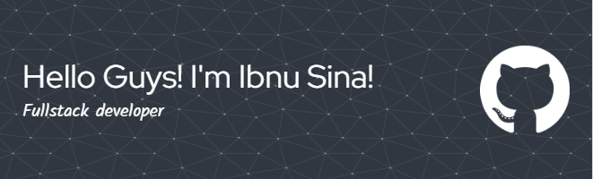

# Hi there! 👋 I'm Ibnu Sina Sudrajat

  

## 🧠 About Me

I'm **Ibnu Sina Sudrajat** ([@ibnusna](https://github.com/ibnusna)), a passionate web developer and technology enthusiast currently diving deep into basic web development. I'm pursuing my studies at **Universitas Bina Sarana Informatika** while actively building my expertise in web technologies.

As an **independent developer**, I focus on creating digital solutions with a strong emphasis on **full-stack development**, **UI/UX design**, and **AI engineering**. My journey centers around mastering web development while exploring the fascinating intersection of design and artificial intelligence.

## 💡 Tech Stack & Skills

Currently building my foundation with:

  

**Development Focus:**

- 🎯 Full-Stack Web Development
- 🎨 UI/UX Design
- 🤖 AI Engineering
- 📱 Responsive Design

## 🛠 Featured Projects

### 🎓 Web Ujian Platform

A comprehensive examination web application built with native PHP, showcasing my ability to create functional educational tools.

**Project Goals:**

- Personal branding and portfolio development
- Contributing to open-source community
- Building practical solutions for real-world problems

## 🌱 Currently Learning

I'm actively expanding my skillset with:

- **PHP Fundamentals** - Building solid backend foundation
- **Tailwind CSS** - Modern utility-first styling
- **Roadmap (3-month target):**
  - ✅ PHP Native Development
  - ⏳ Tailwind CSS Mastery
  - 🎯 Laravel Framework
  - 🗄️ MySQL Database
  - 📱 Bootstrap Framework

## 📊 GitHub Statistics

  

  

## 🎮 Dynamic Animations

**🐍 Snake Game Animation**

**🎯 Pac-Man Contribution Graph**
<picture>

  <source media="(prefers-color-scheme: dark)" srcset="https://raw.githubusercontent.com/ibnusna/ibnusna/output/pacman-contribution-graph-dark.svg">
  <source media="(prefers-color-scheme: light)" srcset="https://raw.githubusercontent.com/ibnusna/ibnusna/output/pacman-contribution-graph.svg">
  
</picture>

## 🌍 Connect With Me

I'm always open to collaboration, freelance opportunities, and connecting with fellow developers!

  

## ⚡ Fun Facts

- 🎵 I code while listening to music - it's my creative fuel!
- 🎨 Passionate about design and AI integration
- 🚀 Always eager to learn cutting-edge technologies
- 💡 Believe in the power of continuous learning and growth

## 🏆 GitHub Achievements

  

---

  
**💬 Let's Build Something Amazing Together!**

_"The best way to predict the future is to create it"_

